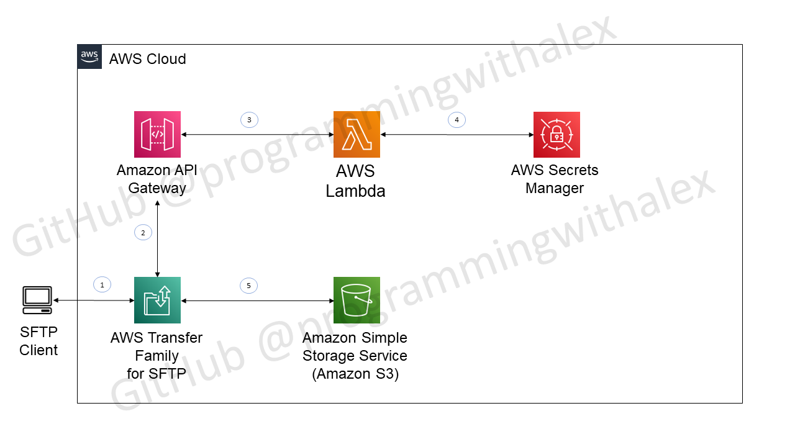

# aws_sftp_server

Copyright (c) 2022, [GitHub@programmingwithalex](https://github.com/programmingwithalex)

---

## Series Outline

1. [Create SFTP server - SSH key authentication](https://docs.aws.amazon.com/transfer/latest/userguide/create-server-sftp.html)

2. [Create SFTP server - password authentication](https://aws.amazon.com/blogs/storage/enable-password-authentication-for-aws-transfer-for-sftp-using-aws-secrets-manager/)

3. [Create separate IAM base and admin user roles and policies](https://docs.aws.amazon.com/transfer/latest/userguide/requirements-roles.html)

     * base user will only be allowed to download from SFTP server
     * admin user will be allowed to download, upload, and delete from SFTP server

4. [Setup AWS web application firewall to restrict IP access on server-level](https://aws.amazon.com/blogs/storage/securing-aws-transfer-family-with-aws-web-application-firewall-and-amazon-api-gateway/)]

5. Resrict IP access at the user-level

6. Email notifications for file uploads to SFTP server

### Create SFTP Server - SSH Key Authentication

* Connecting with SSH keys via WinSCP:
  * Public key pasting into AWS:
    * `ssh-rsa AAAAB3Nz...`
  * Load public key to be pasted by loading private key in puttygen
* When creating users on SFTP server on AWS:
  * Set both as `Restricted`
  * Set `admin` user `Home directory` to empty

### Create SFTP Server - Password Authentication

* Use `CloudFormation` script found on [AWS blogs](https://aws.amazon.com/blogs/storage/enable-password-authentication-for-aws-transfer-for-sftp-using-aws-secrets-manager/)
* Alternatively, use the same file downloaded locally in the repository with slight modifications to provide custom names for resources created
  * `aws_files\aws-transfer-custom-idp-secrets-manager-apig.template.yml`

### Create Separate IAM Base and Admin User Roles and Policies

* Reference `aws_files` folder for scripts necessary
  * `aws_files\iam_role_user_base.json`
    * role: `iam-role-sftp-user-base`
    * policy: `iam-policy-sftp-user-base`
  * `aws_files\iam_role_user_admin.json`
    * role: `iam-role-sftp-user-admin`
    * policy: `iam-policy-sftp-user-admin`

* Trust relationship must be updated for each role:
  * `aws_files\iam_role_user_trust_relationship.json`
    * Set on IAM > Role > Trust Relationships

* [Prevent directory traversing for users](https://docs.aws.amazon.com/transfer/latest/userguide/logical-dir-mappings.html)

  * Set `HomeDirectoryDetails` from `CloudFormation` script in `Secrets Manager` that is accessed in `lambda` function
  * Prevents traversing up directories if want to restrict to user folder
  * Hides top-folder name from user

### Resrict IP Access at the User-Level

* Access incoming IP from lambda function with `event['sourceIp']`

```python
def lambda_handler(event, context):
    source_ip = event['sourceIp']
```

### Email Notifications for File Uploads to SFTP Server

Create SNS topic steps:

1. Create AWS SNS (Simple Notification Service) topic
2. Subscribe to SNS topic (email, sms, ...)
3. Modify access policy of SNS topic to allow S3 bucket to publish to SNS
  a. Reference `aws_files\sns_topic_s3_access_policy.json`

Two options to link SNS topic to S3 event notifications:

1. Link SNS topic to S3 bucket (out-of-the-box) steps:
  a. Create S3 event notification that is linked to SNS topic that executes on PUT events

2. Link SNS topic to S3 bucket (custom) steps:
  a. Create AWS lambda function that executes SNS topic (reference `aws_files\lambda_sns_handler.py`)
  b. Modify AWS IAM role's policy assigned to lambda function to allow `sns:Publish`
  c. Create S3 event notification that is linked to lambda function that executes on PUT events

---

## Possible Issues and Solutions

### Connecting to SFTP Server (WinSCP)

* WinSCP > New Session > Advanced > Directories > Remote Directories
  * Set to empty

### File Upload Successful but Error Setting Permission and/or Timestamp (WinSCP)

1. Menu > Options > Preferences > Transfer > Edit
2. Common Options > Uncheck “Preserve timeStamp”
3. Upload options > uncheck “Set permissions”

---

## To Do

* Explore [alternatives to Secrets Manager for authentication with Cognito](https://docs.aws.amazon.com/transfer/latest/userguide/custom-identity-provider-users.html)

---



---

## License

[BSD 3-Clause License](https://github.com/programmingwithalex/aws_sftp_server/blob/main/LICENSE)
